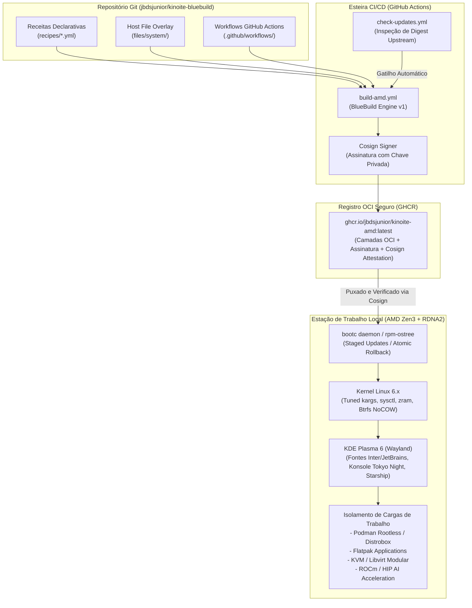

# Documento de Arquitetura Técnica (TAD)

## Imagem OCI Imutável Fedora Kinoite Custom (BlueBuild)

---

### Metadados do Documento

| Atributo                   | Detalhe                                                                  |
| :------------------------- | :----------------------------------------------------------------------- |
| **Projeto**                | `kinoite-bluebuild` (Fedora Kinoite Custom)                              |
| **Target de Distribuição** | `ghcr.io/jbdsjunior/kinoite-amd:latest`                                  |
| **Papel do Autor**         | Arquiteto de Software Principal (Principal Software & Systems Architect) |
| **Data de Referência**     | Setembro de 2026                                                         |
| **Status**                 | Aprovado para Linha de Base / RFC para Evolução Contínua                 |
| **Classificação**          | Engenharia de Sistemas Operacionais Imutáveis & DevSecOps                |

---

## 1. Visão Geral & Contexto Executivo

### 1.1 Declaração do Problema

Sistemas operacionais de estações de trabalho para engenharia (DevSecOps, desenvolvimento de software, virtualização e IA local) tradicionalmente sofrem de **deriva de configuração (configuration drift)**, dependências mutáveis colidentes, risco elevado em atualizações in-place e atrito na recuperação de desastres. O modelo convencional de pacotes (`dnf install` direto no host) acopla o estado do sistema operacional às bibliotecas de desenvolvimento, comprometendo a reprodutibilidade e a integridade da cadeia de suprimentos (supply chain).

### 1.2 A Solução Arquitetural

O projeto implementa uma **estação de trabalho nativa em contêiner (OCI-native immutable workstation)** utilizando o ecossistema Fedora Kinoite (KDE Plasma 6 Wayland) orquestrado pelo framework **BlueBuild** e gerenciado via **bootc / ostree**.

O sistema operacional inteiro é tratado como um artefato imutável, versionado no Git, construído via GitHub Actions, criptograficamente assinado com Cosign e implantado no host via substituição de imagem transacional atômica (`bootc switch` / `bootc update`), garantindo rollback instantâneo e tempo de recuperação próximo de zero.

### 1.3 Princípios Arquiteturais Cardeais

```
+---------------------------------------------------------------------------------------+
|                               PRINCÍPIOS ARQUITETURAIS                                |
+-----------------------+-----------------------+-----------------------+---------------+
|   1. Imutabilidade    |   2. Integridade &    |   3. Atomicidade &    |  4. KISS &    |
|      First            |      Assinatura       |      Resiliência      |  Zero-Overhead|
| Modificações apenas   | Assinatura Cosign no  | Transição atômica de  | Sem daemons   |
| via Git/CI/CD;        | pipeline antes da     | imagens e rollback    | redundantes;  |
| /usr montado somente  | liberação no registry.| instantâneo com       | uso de flags  |
| leitura no host.      |                       | bootc/ostree.         | nativas Linux.|
+-----------------------+-----------------------+-----------------------+---------------+
```

1. **Imutabilidade First:** O sistema base (`/usr`, `/etc` gerenciado) é imutável. Softwares adicionais residem em contêineres rootless (Podman/Distrobox) ou pacotes isolados (Flatpak).
2. **Integridade & Assinatura:** Segurança incorporada no processo de compilação. Imagens só são aceitas se assinadas por chave criptográfica confiável (Cosign).
3. **Atomicidade e Resiliência:** Atualizações são preparadas em staging em segundo plano. O host nunca fica em estado intermediário corrompido. Qualquer falha operacional é revertida com um único comando (`bootc rollback`).
4. **KISS & Zero-Overhead:** Preferência estrita por interfaces de kernel e systemd nativas (drop-ins, systemd-tmpfiles, sysctl, environment.d) em vez de utilitários de terceiros ou daemons residentes em background desnecessários.

---

## 2. Hardware Baseline & Perfil Operacional

O dimensionamento de kernel, VFS, ZRAM e subsistemas de I/O foi rigorosamente calibrado para o seguinte hardware de referência:

| Subsistema            | Especificação Homologada                              | Impacto Arquitetural                                                                                                     |
| :-------------------- | :---------------------------------------------------- | :----------------------------------------------------------------------------------------------------------------------- |
| **Processador (CPU)** | AMD Ryzen 9 5950X (16 núcleos / 32 threads Zen 3)     | `preempt=full`, `amd_pstate=active`, desativação de NMI watchdog para eliminar jitter em 32 threads.                     |
| **Gráficos (GPU)**    | AMD Radeon RX 6600 XT (8 GB GDDR6, Navi 23 / RDNA2)   | Driver Mesa RADV, aceleração VA-API Freeworld, override HIP/ROCm `HSA_OVERRIDE_GFX_VERSION=10.3.0` (gfx1032 -> gfx1030). |
| **Memória (RAM)**     | 64 GB DDR4                                            | ZRAM com algoritmo `zstd` limitado a 32 GB (`min(ram / 2, 32768)`), `vm.swappiness=150`, `watermark_scale_factor=125`.   |
| **Armazenamento**     | 1 TB NVMe SSD (PCIe Gen4)                             | Btrfs com regras NoCOW (`+C`) em diretórios de gravação pesada de VMs e contêineres via tmpfiles.d.                      |
| **Base do SO**        | Fedora Kinoite 44 (KDE Plasma 6, Wayland puro, bootc) | Remoção completa de daemons legados de virtualização guest, telemetria e navegadores mutáveis no host.                   |

---

## 3. Visão Estrutural da Arquitetura (C4 Model - Nível de Camadas)

### 3.1 Diagrama de Fluxo de Entrega e Execução (End-to-End Delivery Flow)


```mermaid
flowchart TD
    subgraph GitRepo["Repositório Git (jbdsjunior/kinoite-bluebuild)"]
        RECIPES["Receitas Declarativas\n(recipes/*.yml)"]
        OVERLAY["Host File Overlay\n(files/system/)"]
        WORKFLOWS["Workflows GitHub Actions\n(.github/workflows/)"]
    end

    subgraph CICD["Esteira CI/CD (GitHub Actions)"]
        CHECK["check-updates.yml\n(Inspeção de Digest Upstream)"]
        BUILD["build-amd.yml\n(BlueBuild Engine v1)"]
        SIGN["Cosign Signer\n(Assinatura com Chave Privada)"]
    end

    subgraph Registry["Registro OCI Seguro (GHCR)"]
        OCI_IMG["ghcr.io/jbdsjunior/kinoite-amd:latest\n(Camadas OCI + Assinatura + Cosign Attestation)"]
    end

    subgraph WorkstationHost["Estação de Trabalho Local (AMD Zen3 + RDNA2)"]
        BOOTC["bootc daemon / rpm-ostree\n(Staged Updates / Atomic Rollback)"]
        KERNEL["Kernel Linux 6.x\n(Tuned kargs, sysctl, zram, Btrfs NoCOW)"]
        DESKTOP["KDE Plasma 6 (Wayland)\n(Fontes Inter/JetBrains, Konsole Tokyo Night, Starship)"]
        WORKLOADS["Isolamento de Cargas de Trabalho\n- Podman Rootless / Distrobox\n- Flatpak Applications\n- KVM / Libvirt Modular\n- ROCm / HIP AI Acceleration"]
    end

    RECIPES --> BUILD
    OVERLAY --> BUILD
    WORKFLOWS --> BUILD
    CHECK -->|Gatilho Automático| BUILD
    BUILD --> SIGN
    SIGN --> OCI_IMG
    OCI_IMG -->|Puxado e Verificado via Cosign| BOOTC
    BOOTC --> KERNEL
    KERNEL --> DESKTOP
    DESKTOP --> WORKLOADS
```

### 3.2 Diagrama de Separação de Responsabilidade em Camadas (Layered Architecture)


```mermaid
graph TD
    subgraph L5["Camada 5: Aplicações & Cargas de Trabalho Isoladas"]
        APP_FLATPAK["Aplicações de Desktop (Flatpak System/User)"]
        APP_DEV["Dev Environments (Distrobox / Podman Rootless)"]
        APP_VIRT["Virtualização Isolada (KVM / QEMU / Libvirt)"]
        APP_AI["IA & Inferência Local (Ollama / PyTorch ROCm)"]
    end

    subgraph L4["Camada 4: Sessão de Usuário & Shell UX"]
        ENV_SESSION["Systemd Environment.d (Wayland Ozone, RADV, Truecolor)"]
        SHELL_UX["Shell Interativo (Starship, Zoxide, FZF, Eza, Bat)"]
        UI_THEME["Tipografia Mac-Like & Konsole Tokyo Night"]
    end

    subgraph L3["Camada 3: Automação do Sistema & Serviços"]
        TIMERS["Timers de Atualização Inteligentes (bootc, flatpak, podman, soar)"]
        NET_RESILIENCE["ExecCondition via D-Bus NetworkManager (Anti-Metered/Offline)"]
        TMPFILES["Btrfs NoCOW Enforcement (tmpfiles.d / user-tmpfiles.d)"]
        SYS_HARDEN["SSHD Hardening, Blacklist Modprobe, Polkit Libvirt"]
    end

    subgraph L2["Camada 2: Imagem Base OCI & Gestor Transacional"]
        BASE_OS["Fedora Kinoite 44 OCI Base"]
        BLUEBUILD["Módulos BlueBuild (RPM Fusion Freeworld, KVM, Fonts)"]
        BOOTC_ENGINE["bootc / rpm-ostree (Staged Deployments)"]
    end

    subgraph L1["Camada 1: Kernel, Memória & Subsistema de I/O"]
        K_ARGS["Kargs: amd_pstate=active, preempt=full, iommu=pt, CIS mitigations"]
        SYSCTL_TUNE["Sysctl: TCP BBR+FQ, VFS cache 50, dirty ratios NVMe, inotify 512k"]
        ZRAM_GEN["ZRAM zstd: 32 GB Swap / swappiness=150 / page-cluster=0"]
    end

    L1 --> L2
    L2 --> L3
    L3 --> L4
    L4 --> L5
```

---

## 4. Engenharia dos Módulos Declarativos (BlueBuild Recipes)

A decomposição das receitas em `recipes/` adota alta coesão e baixo acoplamento:

| Arquivo de Módulo     | Propósito de Engenharia                     | Decisões Chave                                                                                                                                                                                                                                          |
| :-------------------- | :------------------------------------------ | :------------------------------------------------------------------------------------------------------------------------------------------------------------------------------------------------------------------------------------------------------ |
| `recipe-amd.yml`      | Orquestrador principal da variante AMD      | Herda de `quay.io/fedora/fedora-kinoite`, injeta `files/system/`, orquestra submódulos e finaliza com `initramfs` e `signing`.                                                                                                                          |
| `common-debloat.yml`  | Minimização da superfície de ataque         | Eliminação de navegadores embutidos no host (`firefox`), lojas de pacotes ostree redundantes e agentes legados de VM (`qemu-guest-agent`, `open-vm-tools`, `hyperv-daemons`).                                                                           |
| `common-drivers.yml`  | Codecs multimídia e aceleração GPU          | Mesa Freeworld (`mesa-va-drivers-freeworld`, `mesa-vulkan-drivers-freeworld`), FFmpeg RPM Fusion completo, plugins GStreamer bad/ugly e codecs de áudio (`pipewire-codec-aptx`).                                                                        |
| `common-kvm.yml`      | Pilha de virtualização bare-metal           | Pacotes `@virtualization`, `gnome-boxes`, suporte TPM emulado (`swtpm`) para execução segura de VMs Windows 11 / Linux.                                                                                                                                 |
| `common-tools.yml`    | Ferramental moderno CLI & DevSecOps         | Repositórios Subatomic Terra e Tailscale; utilitários modernos de substituição (`eza`, `bat`, `btop`, `ripgrep`, `fd-find`, `fzf`, `zoxide`), contêineres (`distrobox`, `docker-compose`, `podman-docker`) e diagnóstico de GPU (`nvtop`, `radeontop`). |
| `common-fonts.yml`    | Tipografia de alta precisão                 | Fontes `Inter Variable`, `Liberation`, `MS Core Fonts` e Nerd Fonts (`JetBrainsMono`, `FiraCode`, `SymbolsOnly`).                                                                                                                                       |
| `common-systemd.yml`  | Orquestração de daemons e sockets           | Mascaramento de serviços desnecessários (`systemd-remount-fs.service`, `mcelog.service`), ativação modular de sockets libvirt (`virtqemud.socket`, etc.) e habilitação de timers de manutenção.                                                         |
| `common-kargs.yml`    | Configuração imutável da linha de boot      | Ativação do driver P-State nativo Zen 3, preempção desktop total, isolamento IOMMU e mitigação de vulnerabilidades de kernel (KSPP / CIS Benchmark).                                                                                                    |
| `common-flatpaks.yml` | Camada de aplicativos de produtividade e UI | Instalação centralizada em escopo de sistema para browsers (`Brave`, `Chrome`), ferramentas de Dev (`VS Code`), monitoramento (`MissionCenter`, `Warehouse`, `Flatseal`) e comunicação.                                                                 |
| `common-brew.yml`     | Gerenciador de pacotes complementar         | Integração do Homebrew e do gerenciador Soar para binários portáveis sem contaminação do host.                                                                                                                                                          |

---

## 5. Subsistemas Críticos & Especificação Técnica de Tuning

### 5.1 Subsistema de Memória e Swap ZRAM

- **Política ZRAM:** Alocação de swap compactado via `systemd-zram-generator` configurada em `/usr/lib/systemd/zram-generator.conf.d/60-zram-policy.conf`:
  $$\text{zram-size} = \min\left(\frac{\text{RAM}}{2}, 32768\right) = 32\text{ GB}$$
- **Algoritmo de Compressão:** `zstd`, provendo razão de compressão típica de 3:1 com descompressão ultra-rápida.
- **Calibração de Kernel (`sysctl`):**
  - `vm.swappiness = 150`: Prioriza a transferência de páginas anônimas ociosas para o ZRAM antes de descartar o cache de arquivos (pagecache), mantendo o sistema responsivo durante compilações e execução de LLMs.
  - `vm.page-cluster = 0`: Desativa a leitura em bloco sequencial de páginas de swap; como o ZRAM é RAM de acesso aleatório, a paginação 1:1 elimina amplificação de leitura inútil e latência.
  - `vm.watermark_scale_factor = 125`: Mantém uma margem segura de páginas livres, acionando o `kswapd` antecipadamente para evitar picos de latência (direct reclamation stalls).
- **Interação com `tuned` (Fedora 41+):** o Plasma direciona perfis de energia via `tuned-ppd`. Com o perfil *Performance* ativo, `throughput-performance` sobrepõe `vm.swappiness` (10) e os limites de `vm.dirty_*` em runtime — escolha deliberada do usuário no KDE, documentada como interação conhecida e não como drift. Nos demais perfis (`balanced`/`desktop`), a política declarada da imagem prevalece.

### 5.2 Subsistema de Armazenamento e Btrfs NoCOW

Btrfs utiliza CoW (Copy-on-Write), o que gera severa fragmentação e degradação em cargas com escritas aleatórias em arquivos pré-alocados (imagens de disco `.qcow2` / `.raw` e bases de contêineres).

- **Enforcement Automático:** Aplicado via `systemd-tmpfiles` antes da criação de arquivos nos seguintes caminhos:
  - `/var/lib/libvirt/images` (`+C`)
  - `/var/lib/containers/storage` e volumes (`+C`)
  - `/var/lib/docker` (`+C`)
  - `/var/lib/distrobox` (`+C`)
  - Espaços de usuário correspondentes (`~/.local/share/containers/storage`, `~/.local/share/libvirt/images`).

### 5.3 Subsistema Gráfico, IA Local & Multimídia

- **Aceleração 3D / Vulkan:** `AMD_VULKAN_ICD=RADV`, selecionando o driver de código aberto de alto desempenho da comunidade Mesa.
- **Suporte a IA / ROCm:** O hardware host conta com a GPU RX 6600 XT (arquitetura Navi 23 / `gfx1032`). Por padrão, runtimes de IA (ROCm/HIP, PyTorch, llama.cpp) suportam primariamente arquiteturas comerciais da linha CDNA ou Navi 21 (`gfx1030`). A variável:
  $$\text{HSA\_OVERRIDE\_GFX\_VERSION} = 10.3.0$$
  está definida como fonte única de verdade em `/usr/lib/environment.d/60-kinoite-environment.conf` (e injetada em contêineres via especificação CDI `/etc/cdi/amdgpu.yaml`), permitindo que contêineres e aplicações executem kernels HIP diretamente na GPU sem falhas de inicialização de hardware.
- **Calibração de Áudio & Periféricos (WirePlumber 0.5 & Udev):**
  - **Headset MCHOSE X9:** Bypass de atenuação ALSA via hardware (`api.alsa.soft-mixer = false`, `api.alsa.ignore-dB = true` em `51-mchose-x9.conf`).
  - **Fones Bluetooth TWS (ex: Baseus Bass EP10 Pro):** Manutenção estrita da sincronização de hardware AVRCP (`bluez5.hw-volume`). Fones True Wireless Stereo possuem DACs e limitadores dinâmicos (DRC/AGC) independentes por auricular; desativar o controle de volume em hardware provoca bombeamento assimétrico de ganho e descalibração do equilíbrio estéreo L/R durante picos musicais. A atenuação para audição em volumes baixos deve operar acima do degrau de quantização de firmware (baseline $\ge$ 15%) com controle fino de ganho delegado aos sliders de aplicação.
  - **Política Global Bluetooth & Codecs Hi-Res:** Prevenção de rebaixamento de qualidade para HSP/HFP mono via `bluetooth.autoswitch-to-headset-profile = false` e priorização declarativa de codecs de alta resolução (`LDAC > AAC > SBC-XQ > SBC`) com taxa de bits adaptativa (`bluez5.a2dp.ldac.quality = "auto"`) em `80-bluetooth-policy.conf`, garantindo streaming de até 990 kbps (24-bit/96kHz) com estabilidade de conexão contínua.
  - **Acesso Direto a Periféricos HID (`70-peripherals.rules`):** Regras udev com tag `uaccess` em `/usr/lib/udev/rules.d/70-peripherals.rules` concedem permissões seguras sem necessidade de privilégios de root para controle de dispositivos de entrada de baixa latência (headset MCHOSE X9, mouse gamer VXE, teclado mecânico BY Tech e controladora RGB de placa-mãe ITE).

### 5.4 Automação de Atualizações com Resiliência de Rede

O sistema implementa uma automação de atualização sem precedentes em estações Linux:

- **Janela de Execução:** Os timers de atualização (`bootc-fetch-apply-updates`, `flatpak-system-update`, `podman-auto-update`, `soar-upgrade-packages`) iniciam **5 minutos após o boot** (`OnBootSec=5m`) e executam **a cada 45 minutos** (`OnUnitActiveSec=45m`).
- **Resiliência D-Bus / NetworkManager:** Para impedir consumo indevido de franquias móveis ou falhas ruidosas quando offline, o serviço executa a verificação prévia:
  ```bash
  ExecCondition=/usr/bin/bash -c 'm=$(/usr/bin/busctl --system get-property org.freedesktop.NetworkManager /org/freedesktop/NetworkManager org.freedesktop.NetworkManager Metered 2>/dev/null || true); c=$(/usr/bin/busctl --system get-property org.freedesktop.NetworkManager /org/freedesktop/NetworkManager org.freedesktop.NetworkManager Connectivity 2>/dev/null || true); [[ -n "$m" && -n "$c" && "$m" != *" 1" && "$m" != *" 3" && "$c" != *" 1" && "$c" != *" 2" && "$c" != *" 3" ]]'
  ```
  Se a conexão estiver tarifada (Metered) ou em estado de portal cativo/sem internet (Connectivity != 4), o serviço aborta de forma limpa com código zero (skip), sem poluir o journal com mensagens de erro.
- **Priorização de Recursos:** O processo de download e descompressão de camadas opera em classe de I/O e CPU idle (`Nice=19`, `CPUSchedulingPolicy=idle`, `IOSchedulingClass=idle`), garantindo impacto nulo na renderização do desktop a 144Hz+.

---

## 6. Auditoria de Arquitetura & Status das Dívidas Técnicas

Durante a auditoria contínua do repositório pela perspectiva do Arquiteto Revisor, os seguintes pontos foram avaliados e saneados para o hardware baseline:

|   Item   | Arquivo / Componente                  | Natureza do Problema                                                                                                             | Status / Resolução                                                     |
| :------: | :------------------------------------ | :------------------------------------------------------------------------------------------------------------------------------- | :--------------------------------------------------------------------- |
| **A-01** | `recipes/common-flatpaks.yml`         | Verificação de duplicatas na lista de pacotes Flatpak.                                                                           | **Resolvido:** Lista higienizada e validada sem entradas duplicadas.   |
| **A-02** | `.github/workflows/check-updates.yml` | Periodicidade de checagem upstream a cada 2 horas (`0 */2 * * *`).                                                               | **Homologado:** Cron mantido a cada 2h e alinhado no `AGENTS.md`.      |
| **A-03** | `recipes/common-drivers.yml`          | Pacotes ROCm mantidos comentados no host em prol de contêineres/Distrobox/Ollama.                                                | **Homologado:** Padrão arquitetural adotado para manter imagem < 4 GB. |
| **A-04** | `.github/workflows/build-amd.yml`     | Build manual (`workflow_dispatch`) e disparo disparado via detecção de digest em `check-updates.yml`.                            | **Homologado:** Evita rebuilds desnecessários sem novas camadas.       |
| **A-05** | `recipes/common-brew.yml`             | Integração do módulo `soar` com o timer do systemd.                                                                              | **Resolvido:** Drop-ins garantem resiliência de rede e janela de 45m.  |
| **A-06** | `recipes/common-kargs.yml`            | Parâmetro `amd_iommu=on` inválido no kernel e kargs redundantes no Fedora 44 (`randomize_kstack_offset=on`, `kvm_amd.nested=1`). | **Resolvido:** Expurgo completo realizado, mantendo apenas `iommu=pt`. |
| **A-07** | `files/system/etc/rpm-ostreed.conf`   | Arquivo legado com `AutomaticUpdatePolicy=stage` sem guarda de rede D-Bus.                                                       | **Resolvido:** Arquivo removido em favor do `bootc update`.            |
| **A-08** | `files/system/etc/profile.d/*`        | Presença de `\|\| exit 0` no retorno de shells não interativos gerando risco de encerramento de sessão.                          | **Resolvido:** Substituído por `return 0 2>/dev/null` seguro.          |
| **A-09** | `.../70-browser-flags.conf`           | Flags de Wayland e aceleração de GPU comentadas para o Google Chrome, apesar de instalado.                                       | **Resolvido:** Diretivas descomentadas e ativadas no tmpfiles.         |
| **A-10** | `files/system/usr/lib/sysctl.d/*`     | Sysctls redundantes com defaults do Fedora 44 (`ptrace_scope=1`, `protected_fifos=2`, `use_tempaddr=2`).                          | **Resolvido:** Expurgo realizado, mantendo apenas tuning explícito.    |
| **A-11** | `recipes/common-tools.yml`            | Pacote `podman-machine` exclusivo para macOS/Windows instalado em host Linux nativo.                                             | **Resolvido:** Pacote removido em favor do Podman nativo.              |
| **A-12** | `files/system/.../chromium-flags.conf`| Ausência de flags para decodificação e codificação de vídeo aceleradas por hardware no Chromium.                                  | **Resolvido:** Flags VA-API zero-copy GL ativadas declarativamente.    |
| **A-13** | `files/system/etc/containers/nodocker`| Supressão declarativa de alertas de emulação Podman-Docker para compatibilidade CLI transparente.                                 | **Homologado:** Arquivo mantido e documentado na arquitetura.          |
| **A-14** | `.../wireplumber.conf.d/80-bluetooth-policy.conf` | `bluez5.a2dp.ldac.quality` declarada em `monitor.bluez.properties` (no-op); por `pipewire-props(7)` é propriedade de dispositivo. | **Resolvido:** Movida para `monitor.bluez.rules` com match `~bluez_card.*`. |
| **A-15** | `.github/workflows/build-amd.yml`     | `blue-build/github-action@v1` referenciada por tag mutável, violando pinagem SHA de supply chain.                                 | **Resolvido:** Pinada em `c295af86` (v1) com comentário de versão.     |
| **A-16** | `recipes/common-systemd.yml`          | Habilitações redundantes com presets do Fedora 44 (`resolved`, `firewalld`, 7 sockets libvirt).                                   | **Resolvido:** Removidas; presets comprovadamente aplicados no build.  |
| **A-17** | `files/system/usr/lib/sysctl.d/*` + `resolved.conf.d` + override Flatpak VS Code | Redeclarações de defaults (`fs.suid_dumpable`, `accept_ra=default`, `Cache=yes`, `CacheFromLocalhost`) e entrada morta `xdg-run/docker.sock`. | **Resolvido:** Expurgo de defaults e remoção da entrada morta.         |
| **A-18** | `recipes/common-kargs.yml`            | `bluetooth.disable_ertm=1`: quirk legado de gamepads pré-5.12, sem gamepad homologado; TWS A2DP/AVRCP não usa ERTM.               | **Resolvido:** Karg removido; `btusb.enable_autosuspend=n` mantido.    |
| **A-19** | `recipes/common-drivers.yml` / `common-fonts.yml` | `twolame`, `vorbis-tools` e `wqy-zenhei-fonts` sem função homologada (encoders redundantes; CJK coberto pelo Noto).         | **Resolvido:** Pacotes removidos; `pipewire-codec-aptx` mantido por decisão. |
| **A-20** | `.../ssh/sshd_config.d/50-kinoite-hardening.conf` | Autenticação por senha habilitada por padrão no sshd (superfície de brute-force).                                                 | **Resolvido:** `PasswordAuthentication no` + `KbdInteractiveAuthentication no`. |
| **A-21** | Host (runtime)                        | Kargs da imagem ausentes do bootconfig: diff de `kargs.d` vazio desde a primeira implantação (deadlock de bootstrap do bootc).    | **Ação:** `rpm-ostree kargs --append` único + reboot (ver POST_INSTALL §7). |

---

## 7. Recomendações e Melhorias Arquiteturais Sugeridas (Roadmap)

### 7.1 Melhoria 1: Implementação de CDI (Container Device Interface) para Aceleração ROCm

- **Status:** **Implementado** declarativamente na imagem base (`files/system/etc/cdi/amdgpu.yaml`).
- **Contexto:** Manter o runtime do ROCm limpo do sistema base é uma excelente prática para evitar inflar a imagem OCI em mais de 4 GB. No entanto, passar a GPU AMD RX 6600 XT para contêineres Podman frequentemente exige permissões excessivas (`--privileged`, `--device /dev/kfd`, `--device /dev/dri`).
- **Implementação:** Especificação declarativa de **CDI (Container Device Interface)** em `/etc/cdi/amdgpu.yaml` (CDI spec v0.5.0, kind `amd.com/gpu`). Permite executar contêineres de inferência (como Ollama, vLLM ou PyTorch) com a flag limpa e segura `podman run --device amd.com/gpu=all`, mapeando os nós `/dev/kfd`, `/dev/dri/renderD128` e `/dev/dri/card1` com injeção automática de `HSA_OVERRIDE_GFX_VERSION=10.3.0`.

### 7.2 Melhoria 2: CI/CD GitOps com Validação Automatizada de Boot (Boot Validation Gate)

- **Contexto:** Atualmente, a imagem é compilada no GitHub Actions, mas se um módulo de kernel ou argumento do GRUB corromper o initramfs, o erro só será notado pelo usuário após a reinicialização da máquina física.
- **Proposta Arquitetural:** Integrar um job de teste no GitHub Actions utilizando `qemu-system-x86_64` ou `bootc-image-builder` em modo headless (KVM nos runners do GitHub) para realizar um boot de validação (Sanity Boot Check) antes de mover a tag `:latest` no GHCR.

### 7.3 Melhoria 3: Automação Integrada de Políticas Flatpak Overrides

- **Status:** **Implementado** declarativamente na imagem base (`files/system/usr/share/flatpak/overrides/com.visualstudio.code` sincronizado para `/var/lib/flatpak/overrides/` via tmpfiles).
- **Contexto:** Aplicativos Flatpak (como VS Code e navegadores) executam sob sandboxing restrito. Frequentemente, o desenvolvedor precisa de permissões de acesso ao socket do Podman, Wayland nativo e diretórios de projetos.
- **Implementação:** Template declarativo em `/usr/share/flatpak/overrides/com.visualstudio.code` sincronizado autoritativamente para `/var/lib/flatpak/overrides/com.visualstudio.code` no boot via tmpfiles do sistema (`/usr/lib/tmpfiles.d/60-flatpak-overrides.conf`), fornecendo permissões calibradas (`filesystems=xdg-run/podman:ro;xdg-run/docker.sock:ro;`) para o VS Code acessar o socket de contêiner do Podman e Docker em modo somente leitura (princípio de menor privilégio), viabilizando Dev Containers sem atrito pós-instalação.

### 7.4 Melhoria 4: Autenticação de Supply Chain com Attestation SLSA L3

- **Contexto:** O projeto já utiliza Cosign para assinar a imagem final (`cosign_private_key: ${{ secrets.SIGNING_SECRET }}`).
- **Proposta Arquitetural:** Evoluir para **GitHub Artifact Attestations** (compatível com Sigstore e in-toto), permitindo geração de SBOM (Software Bill of Materials) em formato SPDX e atestação de proveniência criptográfica sem necessidade de gerenciar segredos manuais de chave privada de longo prazo no repositório.

### 7.5 Melhoria 5: Sincronização e Governança da Periodicidade de Checagem Upstream

- **Contexto:** O cron de `.github/workflows/check-updates.yml` está formalizado em `0 */2 * * *` (a cada 2 horas), alinhado com o `AGENTS.md` e a documentação técnica para otimização de cotas de Actions e detecção ágil de patches upstream.

---

## 8. Matriz de Decisões Arquiteturais (ADRs Resumidos)

### ADR-001: Adoção do Framework BlueBuild sobre Containerfile Raw

- **Decisão:** Utilizar o BlueBuild (`recipes/*.yml`) em detrimento de Containerfiles imperativos.
- **Justificativa:** BlueBuild provê abstração declarativa padronizada, suporte nativo a módulos reutilizáveis, compilação otimizada com cache de camadas (`chunkah`), gerenciamento automatizado de initramfs e integração com assinatura Cosign, reduzindo linhas de código imperativo em 70%.

### ADR-002: Transição Nativa de Imagens via `bootc` em vez de `rpm-ostree rebase`

- **Decisão:** Padronizar comandos e documentação no utilitário `bootc` (projeto upstream Red Hat/Fedora para contêineres inicializáveis).
- **Justificativa:** O `bootc` trata a imagem OCI como fonte canônica e de primeira classe, integrando-se diretamente com registries OCI padrão e garantindo consistência semântica com o ecossistema de contêineres corporativo moderno.

### ADR-003: Alocação Agressiva de ZRAM zstd com Alto Swappiness

- **Decisão:** Definir ZRAM para 50% da memória (32 GB) com `vm.swappiness=150` em uma estação de 64 GB de RAM física.
- **Justificativa:** Em ambientes com máquinas virtuais de grande porte e modelos de linguagem locais, a demanda de memória ocorre em surtos abruptos. Manter as páginas ociosas comprimidas em memória ultrarrápida preserva o cache de disco do sistema operacional, evitando gargalos de I/O no NVMe e garantindo estabilidade absoluta contra o OOM killer.

---

## 9. Procedimentos Operacionais Padrão (SOP) & Recuperação de Desastres

| Operação                         | Comando Canônico                                         | Comportamento Esperado                                                                                        |
| :------------------------------- | :------------------------------------------------------- | :------------------------------------------------------------------------------------------------------------ |
| **Verificação de Estado**        | `bootc status`                                           | Exibe a implantação ativa, hash de digest OCI e se há atualizações em staging preparadas para o próximo boot. |
| **Atualização Manual**           | `sudo bootc update`                                      | Baixa atomicamente as novas camadas da imagem em background. Aplicação efetivada no próximo reboot.           |
| **Rollback Atômico**             | `sudo bootc rollback`                                    | Alterna o ponteiro de boot para a implantação imediatamente anterior. Efetivado no próximo reboot.            |
| **Reversão para Upstream**       | `sudo bootc switch quay.io/fedora/fedora-kinoite:latest` | Retorna o sistema ao Fedora Kinoite puro original de fábrica.                                                 |
| **Auditoria de Drift no `/etc`** | `sudo ostree admin config-diff`                          | Lista todas as modificações manuais locais realizadas sobre os arquivos de configuração do sistema.           |

---

_Documento aprovado e mantido sob controle de versão do repositório `jbdsjunior/kinoite-bluebuild`._
